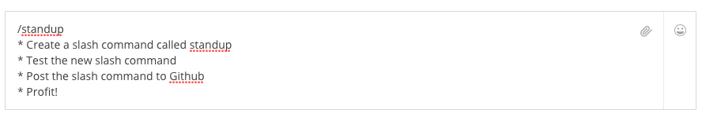
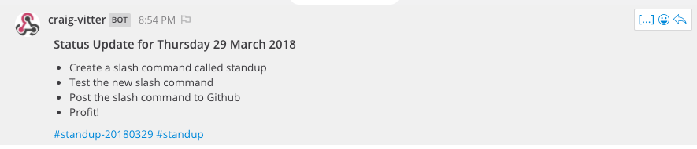
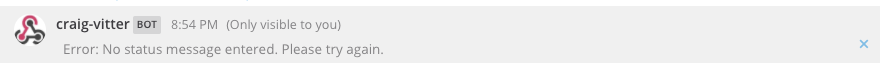

# Mattermost Standup Slash Command

The following code is a Flask based adaptation of George Goldberg's (https://github.com/grundleborg) AWS Lambda based Standup Slash command: https://grundleborg.github.io/posts/mattermost-custom-slash-command-aws-lambda/

 **Import Note**: This application is not really designed for production use. It is meant 
 only to demonstrate how to build useful slash commands using commonly
 available tools like Python and Flask (http://flask.pocoo.org/).
 
# Installing the Slash Command

In order to use this slash command on your Mattermost server you will need:

* A Mattermost server on which you have permissions to add slash commands;
* A server on which you can install and run Python code that the Mattermost server can talk to;

If you have the two things above you can proceed to the installation steps below:

## Setup the Flask Application

The following steps

1. Log into the machine that will host the Python Flask application;
2. Clone this repository to your machine: `git clone https://github.com/cvitter/mattermost-standup-slash.git`;
3. Run the Flask application - there are a number of ways to run the application but I use the following command that runs the application headlessly and captures output into a log file for troubleshooting:

```
sudo python standup.py >> standup.log 2>&1 &
```

**Note**: The app by default will be available on port 5004. If you need to change ports please see the config file


**Config**: the bot supports a handfull of basic config options which can be set in the config file.

```

listen_port = 5004 - Port Value of your choosing
tag_date_format = mdy  -  mdy or ydm
compact_date = False  -  True or False
include_channel = True  -  True or False

```

## Setup the Slash Command

Now that the Flask application is running you have to configure your slash command in Mattermost to connect to the 
application. Inside of Mattermost:

1. Click on the **Main Menu** (located in the left hand side bar next to your team and user name);
2. Select **Integrations** from the drop down menu;
3. Click on **Slash Commands**;
4. Click on **Add Slash Command**;
5. Fill in the form (refer to Mattermost help for full explanations of each field):
	1. Title - your choice (i.e. Standup)
	2. Description - your choice again;
	3. Command Trigger Word - standup
	4. Request URL - the URL of your flask application (i.e. http://something.com:5004/standup)
	5. Response Username - optional
	6. Response Icon - optional
	7. Autocomplete - check this so your users know that the slash command exists
	8. Autocomplete Hint - '[Your status update]'
	9. Autocomplete Description - 'Posts your daily Standup status formatted automatically with appropriate hashtags'
6. Click **Save** to create the slash command.
7. Test the slash command from within Mattermost and profit!

# Using the Slash Command

Once the slash command is set up it is quite easy to use. Type '/standup' and begin entering your markdown formatted status update as demonstrated below:



If you were to submit the status above the command should return the following:



If you only type '/standup' and hit enter you will see the following message returned:




# Make this Project Better (Questions, Feedback, Pull Requests Etc.)

**Help!** If you like this project and want to make it even more awesome please contribute your ideas,
code, etc.

If you have any questions, feedback, suggestions, etc. please submit them via issues here: https://github.com/cvitter/mattermost-standup-slash/issues

If you find errors please feel to submit pull requests. Any help in improving this resource is appreciated!

# License
The content in this repository is Open Source material released under the MIT License. Please see the [LICENSE](LICENSE) file for full license details.

# Disclaimer

The code in this repository is not sponsored or supported by Mattermost, Inc.

# Authors
* Author: [George Goldberg](https://github.com/grundleborg)
* Author: [Craig Vitter](https://github.com/cvitter)

# Contributors
* Contributor: [Bobby Boughton](https://github.com/howaminotme)
 
Please submit Issues and/or Pull Requests.
